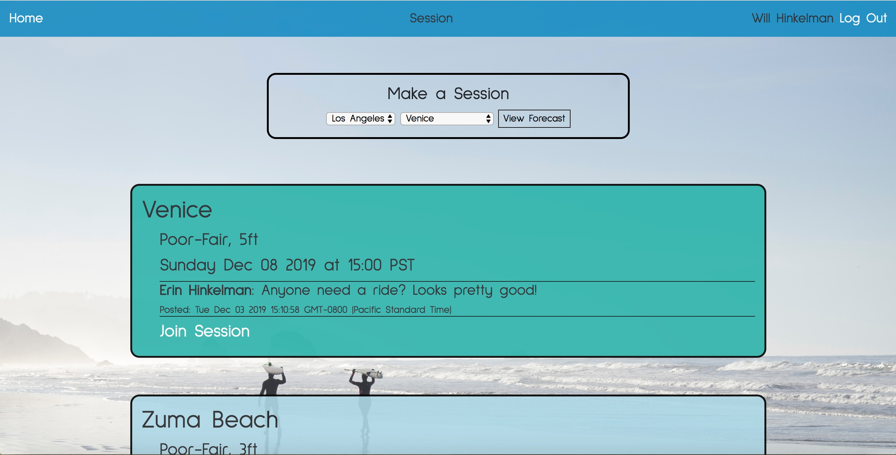
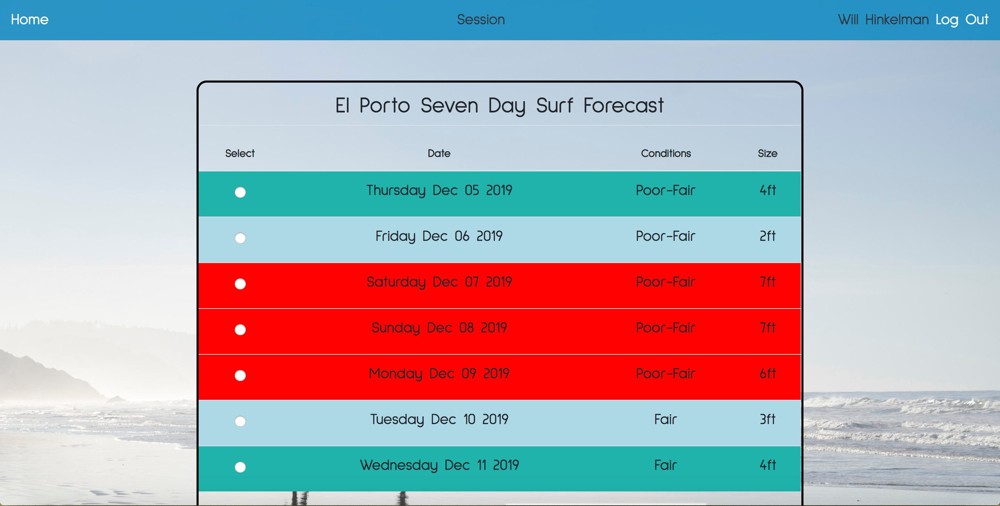

# Session

### Session is a social surf forecast website. Users can view a seven day forecasts and then book a date/time to go.

## 

## Technologies Used
- HTML
- CSS
- JavaScript
- Express.js
- Node.js

## Getting Started
- New users will be prompted to sign into a google account.
- You can then either join someone's surf session or make your own!

[Go To Session](https://hink123.github.io/session/)

## Next Steps
#### In the future I plan to add more counties to choose from and also implement a sorting feature.

